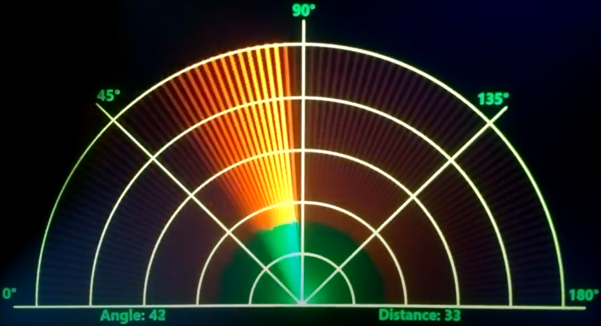
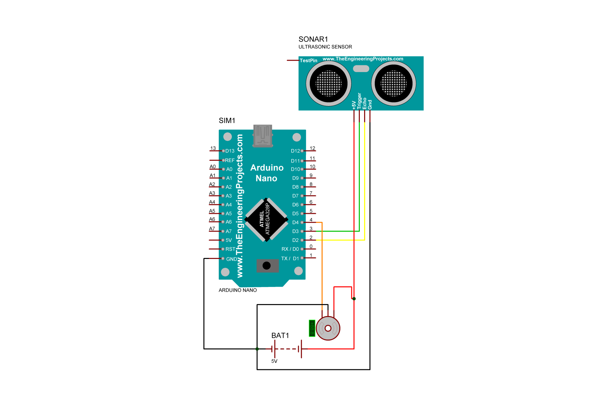

# Radar

### The software and hardware complex is a copy of the existing analogues. Created on the base of Arduino Nano. The software part is written in C# and WPF forms. 

### The structure of device consist of: board Arduino Nano, sensor HC SR04 and servo TS90A.

### The folder sketch_feb21b is required for microcontroller programming via Arduino IDE 
